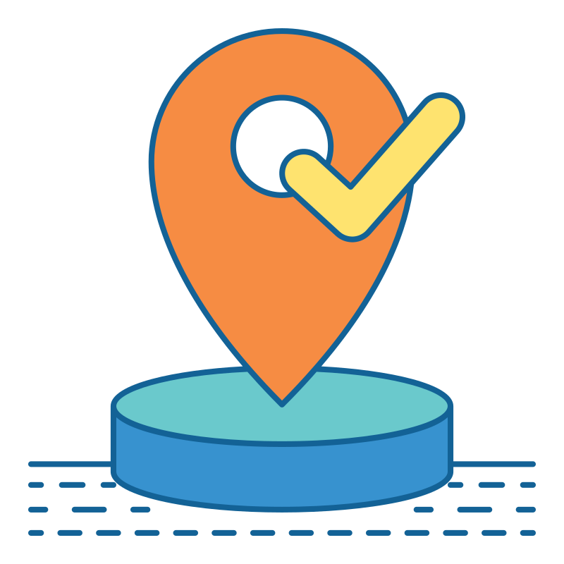

 

 

<h1 align="center"> Caravan </h1>

    <a href="#demo"> Demonstração</a> •
    <a href="#func"> Funcionalidade</a> •
    <a href="#tec"> Tecnologias</a> •
    <a href="#projeto"> Projeto</a> •
       

<h2 id="demo"> 📷 Demonstração </h2>

<h2 align="center">  </h2>
<h2 align="center">  </h2>
<h2 align="center">  </h2>
<h2 align="center">  </h2>

 

 

<h2 id="func"> ⚙ Funcionalidades </h2>

- [x] Página totalmente responsiva  
- [x] Bootstrap modificado com SCSS 
- [x] Acessibilidade  

<h2 id="tec"> 🚀 Tecnologias </h2>

 Esse projeto foi desenvolvido com as seguintes tecnologias: 
 

✔️HTML  
✔️Boostrap  
✔️SCSS  

<h2 id="projeto"> 💻 Projeto </h2> 

Projeto foi desenvolvido para treinar a ferramenta de desenvolvimento Boostrap
 

 

 Criado por Lucas Freitas 🖖🏽| <a href="https://www.linkedin.com/in/lucasfreitas01/"> Faça contato comigo </a> 

